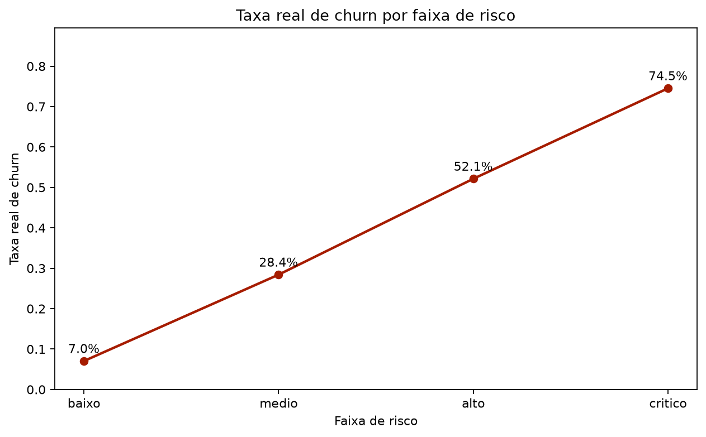
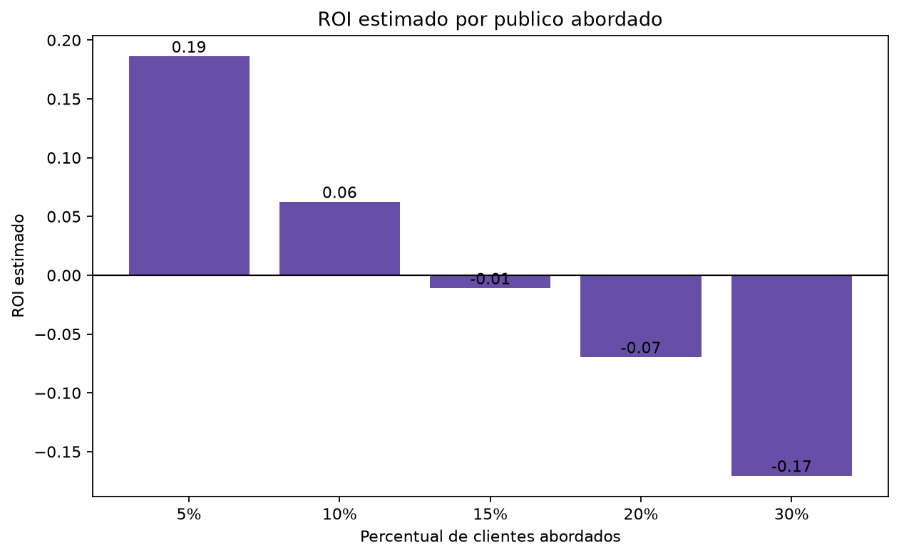
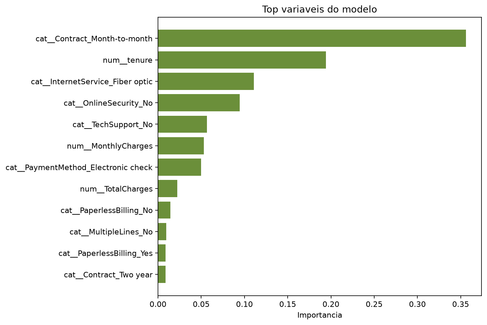

# Análise de Churn e Priorização de Retenção em Telecom

# > Observação: este projeto utiliza uma base pública de churn em telecom para fins educacionais e de portfólio. Os identificadores de clientes presentes na base são tratados apenas como chaves técnicas da amostra e não representam dados sensíveis reais.
## Resumo executivo

- Base analisada: 7.043 clientes de telecom.
- Taxa geral de churn: 26,5%.
- Modelo final: Gradient Boosting.
- ROC AUC em teste: 0,8397.
- Recall de churn: 68,7%.
- Faixa crítica: 74,5% de churn real.
- Melhor cenário simulado: Top 5% com ROI estimado de 0,19.

## Visão geral

Este projeto constrói uma solução analítica para apoiar decisões de retenção em telecom. A proposta é identificar clientes com maior risco estimado de churn, transformar esse risco em uma segmentação acionável e estimar o retorno financeiro de campanhas direcionadas.

O foco não é apenas treinar um modelo de machine learning, mas conectar análise de dados, priorização operacional e decisão executiva. O resultado final é uma base de clientes pontuada por probabilidade de churn, faixa de risco e ação recomendada.

## Problema de negócio

Churn representa perda de receita recorrente e aumento da pressão por aquisição de novos clientes. Em vez de tratar cancelamentos apenas de forma reativa, a empresa pode usar dados para identificar padrões observáveis de risco e priorizar ações preventivas.

A pergunta central do projeto é:

> Como identificar clientes com maior risco de cancelamento para priorizar investimentos de retenção?

O score gerado poderia ser usado por áreas de CRM, retenção, marketing, customer success e planejamento comercial para priorizar filas de contato, ofertas e campanhas.

## Objetivos do projeto

- Estimar probabilidade de churn por cliente.
- Segmentar clientes em faixas de risco.
- Priorizar ações de retenção.
- Simular impacto financeiro de campanhas segmentadas.
- Gerar uma base operacional com score de churn.

## Entregáveis principais

- Base de clientes com score de churn e faixa de risco.
- Lista de clientes priorizados por maior risco estimado.
- Relatório de métricas do modelo.
- Tabela de importância de variáveis.
- Simulação de ROI por percentual de clientes abordados.
- Apresentação executiva do case.

## Base de dados

| Item | Valor |
|---|---:|
| Clientes analisados | 7.043 |
| Taxa geral de churn | 26,5% |
| Variáveis explicativas usadas | 19 |
| Variável alvo | Churn |
| Limitação principal | Ausência de janela temporal explícita |

A base contém informações de perfil, contrato, serviços, pagamento, cobrança e churn. Como não há data clara de extração, data de churn ou janela de previsão, a avaliação não deve ser interpretada como validação temporal out-of-time.

## Metodologia

O projeto foi estruturado para reduzir risco de vazamento de dados e manter a lógica reprodutível:

1. Entendimento inicial da base.
2. Limpeza e tratamento de dados.
3. Separação treino, validação e teste.
4. Uso de `Pipeline` para imputação, escalonamento e encoding.
5. Comparação de modelos.
6. Escolha de threshold na validação.
7. Avaliação final em teste.
8. Segmentação por risco.
9. Simulação de ROI.

Modelos considerados:

- Logistic Regression
- Random Forest
- Gradient Boosting
- HistGradientBoosting
- XGBoost
- LightGBM
- CatBoost

## Modelo final

| Métrica | Resultado |
|---|---:|
| Modelo final | GradientBoosting_sklearn |
| Threshold | 0,342 |
| ROC AUC teste | 0,8397 |
| PR AUC teste | 0,6692 |
| F1 | 0,6266 |
| Recall | 0,6868 |
| Precision | 0,5761 |
| Accuracy | 0,7824 |

O Gradient Boosting foi escolhido por equilíbrio entre desempenho, estabilidade, baixo gap de overfit e simplicidade operacional. A diferença para XGBoost e CatBoost foi pequena, portanto a escolha não deve ser vendida como superioridade estatística absoluta.

## Matriz de confusão

| Resultado | Quantidade |
|---|---:|
| TN - verdadeiros negativos | 634 |
| FP - falsos positivos | 142 |
| FN - falsos negativos | 88 |
| TP - verdadeiros positivos | 193 |

Em churn, falso negativo é um erro crítico, pois representa um cliente que cancelou sem ação preventiva. O objetivo do score é reduzir a dependência de palpite e priorizar a fila de retenção.

## Segmentação de risco

| Faixa de risco | Clientes | Churn real | Taxa real de churn | Probabilidade média |
|---|---:|---:|---:|---:|
| Baixo | 3.779 | 266 | 7,0% | 7,9% |
| Médio | 1.285 | 365 | 28,4% | 29,9% |
| Alto | 1.057 | 551 | 52,1% | 49,5% |
| Crítico | 922 | 687 | 74,5% | 70,9% |

A segmentação mostra concentração clara do risco. Clientes classificados como críticos apresentaram churn real superior a 74%, enquanto clientes de baixo risco ficaram próximos de 7%.



## Impacto financeiro simulado

O ROI é uma simulação, não um resultado financeiro realizado. A simulação usa as seguintes premissas:

- Horizonte mensal.
- Margem de 70%.
- Custo unitário de campanha de R$ 10.
- Uplift esperado de 30%.

| Público | Clientes | Receita preservada estimada | ROI estimado |
|---|---:|---:|---:|
| Top 5% | 352 | R$ 4.175 | 0,19 |
| Top 10% | 704 | R$ 7.480 | 0,06 |
| Top 15% | 1.056 | R$ 10.445 | -0,01 |

Campanhas mais concentradas nos clientes de maior risco tendem a ser financeiramente mais eficientes. A recomendação é iniciar por piloto controlado antes de escalar a campanha.



## Principais fatores associados ao risco previsto

Os fatores abaixo estão associados ao risco previsto de churn. Eles não devem ser interpretados como causas diretas do cancelamento:

- Contrato mensal.
- Menor tempo de relacionamento (`tenure`).
- Internet fibra óptica.
- Ausência de segurança online.
- Ausência de suporte técnico.
- Pagamento via electronic check.
- Mensalidade.



## Limitações e cuidados de interpretação

- Não há validação temporal out-of-time porque a base não possui data clara.
- O horizonte de churn não está explicitado na base.
- O ROI é uma simulação, não um resultado financeiro observado.
- A importância das variáveis não prova causalidade.
- Threshold deve ser recalibrado conforme custo de erro e capacidade operacional.
- Em produção seria necessário teste A/B ou grupo de controle.

## Como executar

Crie o ambiente virtual:

```bash
python -m venv .venv
```

Ative o ambiente no Linux/Mac:

```bash
source .venv/bin/activate
```

Ative o ambiente no Windows PowerShell:

```powershell
.\.venv\Scripts\Activate.ps1
```

Ou ative no Windows CMD:

```cmd
.venv\Scripts\activate
```

Instale as dependências:

```bash
pip install -r requirements.txt
```

Execute os notebooks na ordem:

1. `notebooks/01_entendimento_dados.ipynb`
2. `notebooks/02_dataprep.ipynb`
3. `notebooks/03_feature_selection.ipynb`
4. `notebooks/04_machine_learning.ipynb`
5. `notebooks/05_resultado_negocio.ipynb`

## Estrutura do repositório

```text
churn-retencao-telecom/
  README.md
  requirements.txt
  .gitignore
  data/
    raw/
    processed/
  notebooks/
  reports/
  images/
  presentation/
```

## Próximos passos

- Validação temporal out-of-time.
- Calibração formal das probabilidades.
- Teste A/B ou grupo de controle.
- Monitoramento de drift.
- Integração do score ao CRM.
- Retreinamento periódico.
- Mensuração de uplift real pós-campanha.

## Mensagem final

Machine Learning não reduz churn sozinho. Boas decisões reduzem churn.

O papel do modelo é aumentar a capacidade da empresa de decidir onde agir primeiro, com mais foco, consistência e melhor uso do investimento em retenção.
