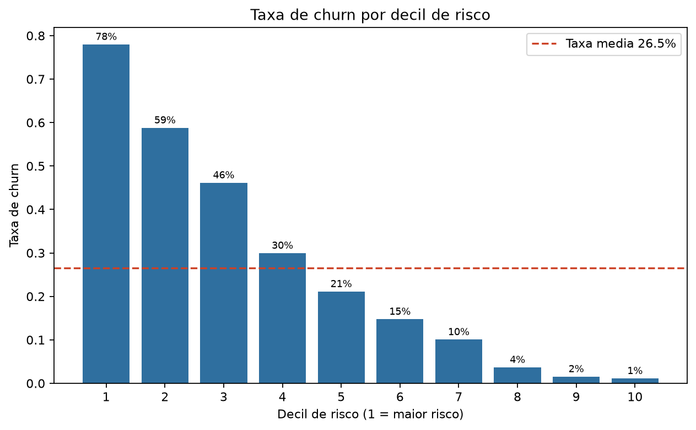
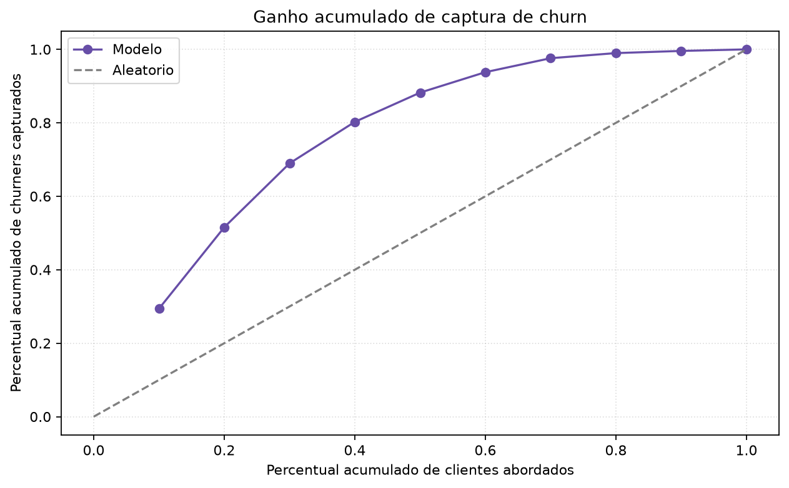

# Análise final para portfólio - Churn

## Objetivo de negócio

O objetivo do projeto é identificar clientes com maior probabilidade de churn para priorizar ações de retenção. A entrega não é apenas um modelo preditivo: é uma lista acionável de clientes, com faixa de risco, score e recomendação de abordagem.

## Escopo e limitações

A base não possui data clara de extração, data de churn ou janela de previsão. Por isso, a avaliação usa treino, validação e teste estratificados, mas não uma validação temporal out-of-time. Em um projeto real de churn, o ideal seria validar o modelo em safras futuras.

O ROI apresentado é uma simulação com premissas de ARPU, margem, custo de campanha e uplift esperado. Ele deve ser lido como estimativa para orientar priorização, não como impacto financeiro comprovado.

## Resultado executivo

O modelo final selecionado foi **GradientBoosting_sklearn**. A escolha considerou desempenho, estabilidade, gap de overfit e simplicidade operacional. A diferença para modelos como XGBoost e CatBoost foi pequena, portanto a recomendação não depende de superioridade estatística absoluta.

## Segmentação de risco

A segmentação mostra que o churn se concentra em grupos específicos. Clientes em risco crítico apresentam churn real muito superior ao grupo de baixo risco.

## Lift e ganho acumulado

Para uma leitura executiva, a curva de lift mostra quanto o modelo concentra churners nos primeiros grupos abordados. Isso é mais acionável do que olhar apenas AUC.

## Principais fatores associados ao risco previsto

As variáveis mais relevantes indicam associação com o risco previsto de churn. Essa leitura não deve ser interpretada como causalidade direta.

## Simulação e sensibilidade de ROI

A simulação estima o retorno financeiro de abordar clientes com maior risco. Como o ROI depende fortemente das premissas, foi criada uma tabela de sensibilidade variando uplift e custo unitário de campanha.

## Recomendação executiva

Usar o score de churn para priorizar um piloto de retenção nos clientes de maior risco, com grupo de controle e mensuração de uplift real. A decisão final de escala deve depender do retorno observado, da capacidade operacional e do custo real das ofertas.
